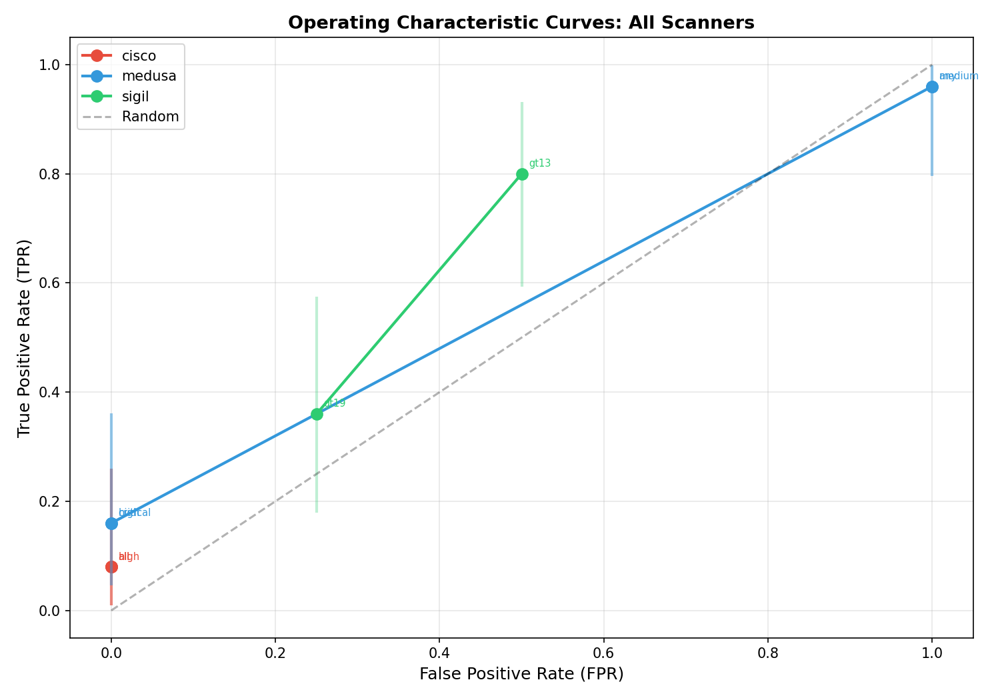
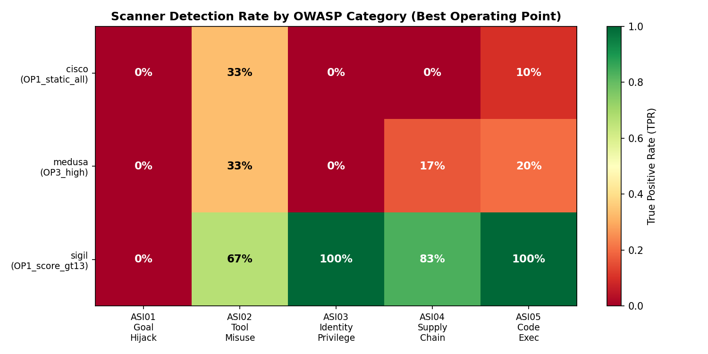

# Agent Security Scanner Operating Characteristics

**No agent security scanner achieves a Youden Index above 0.30. Scanner union provides zero complementarity — all three scanners combined detect exactly what Sigil alone detects (80%). The AOQL ranges 23x across scanners.**

[](LICENSE)
[](https://www.python.org/downloads/)



## Key Results

| Finding | Metric | Evidence |
|---|---|---|
| No scanner achieves adequate discrimination | Max Youden Index: 0.30 (Sigil+bandit) | 37 MCP test cases (25 vulnerable, 12 safe) |
| Scanner union = Sigil alone | Combined TPR = 80% = Sigil TPR | Cisco and MEDUSA detections are strict subsets |
| AOQL spans 23x across scanners | 0.04 (MEDUSA best) to 0.92 (Cisco) | Operating Characteristic curve analysis |
| Strong category-level specialization | ASI01/ASI03: 0% detection; ASI05: 100% | 5 OWASP Agentic AI categories |
| MEDUSA: starkest tradeoff | 96% TPR / 100% FPR → 16% TPR / 0% FPR | Score threshold sweep |
| Cisco MCP Scanner: lowest detection | 8% TPR (2/25) at all operating points | Only detects ASI05 code execution |
| Statistically significant differences | Fisher's exact p<0.001 (Bonferroni-corrected) | Sigil vs Cisco, Sigil vs MEDUSA |

### Best Operating Points by Scanner

| Scanner | Operating Point | TPR | FPR | Youden | TPR 95% CI |
|---|---|---|---|---|---|
| Cisco MCP Scanner | OP1 (static, all) | 0.08 | 0.00 | 0.08 | [0.01, 0.26] |
| MEDUSA | OP3 (high threshold) | 0.16 | 0.00 | 0.16 | [0.05, 0.36] |
| MEDUSA | OP1 (any finding) | 0.96 | 1.00 | -0.04 | [0.80, 1.00] |
| Sigil+bandit | OP1 (score >13) | 0.80 | 0.50 | 0.30 | [0.59, 0.93] |
| Sigil+bandit | OP2 (score >19) | 0.36 | 0.25 | 0.11 | [0.18, 0.57] |

## The Finding

We evaluated three agent security scanners — Cisco MCP Scanner (v4.6.0), MEDUSA (v2026.4.0), and Sigil (with bandit integration) — against a ground-truth corpus of 37 MCP server test cases using Operating Characteristic curve methodology adapted from manufacturing quality assurance.

The core result: **the scanners don't complement each other.** Adding Cisco and MEDUSA to Sigil adds zero detection coverage. And even the best scanner (Sigil) only achieves TPR=0.80 at FPR=0.50 — meaning half of all safe servers are flagged as vulnerable to catch 80% of real vulnerabilities.

Category-level analysis reveals why: ASI01 (tool poisoning) and ASI03 (identity/privilege) have 0% detection by Cisco and MEDUSA at discriminating thresholds. These are arguably the most dangerous agentic attack categories, and no scanner reliably detects them.

## Quick Start

```bash
git clone https://github.com/rexcoleman/cycle12-agent-security-tooling.git
cd cycle12-agent-security-tooling
pip install -r requirements.txt
bash reproduce.sh                    # full reproduction
```

## Scanners Evaluated

| Scanner | Version | Type | Detection Approach |
|---|---|---|---|
| [Cisco MCP Scanner](https://github.com/AISaturdaysLagos/cisco-mcp-scanner) | v4.6.0 | MCP-specific | Pattern matching on tool descriptions |
| [MEDUSA](https://github.com/MEDUSA-Security) | v2026.4.0 | MCP-specific | Static analysis + LLM-assisted scoring |
| Sigil + bandit | latest | General + Python | AST analysis + security linting |

## Methodology

- **Test corpus:** 37 MCP server implementations (25 vulnerable across 5 OWASP categories, 12 safe controls)
- **Analysis:** Operating Characteristic curves, Youden Index optimization, AOQL computation
- **Statistical tests:** Fisher's exact test with Bonferroni correction for pairwise comparisons
- **Framework:** Manufacturing QA methodology (OC curves, AOQL) adapted for security scanner evaluation

Full methodology in [EXPERIMENTAL_DESIGN.md](EXPERIMENTAL_DESIGN.md). All results in [FINDINGS.md](FINDINGS.md).

## Figures

| | |
|---|---|
|  |  |
| *Operating Characteristic curves for all scanners* | *Category-level detection heatmap* |

## Related Work

- [agent-skill-scanner](https://github.com/rexcoleman/agent-skill-scanner) — PyPI-installable agent security scanner (SE-157)
- [agent-skill-scan-action](https://github.com/rexcoleman/agent-skill-scan-action) — GitHub Action for agent security (SE-158)
- [agent-skill-scan-mcp](https://github.com/rexcoleman/agent-skill-scan-mcp) — MCP server for agent security checks (SE-159)
- [controllability-bound](https://github.com/rexcoleman/controllability-bound) — Defense difficulty decomposition framework

## Citation

```bibtex
@software{coleman2026scanneroc,
  title = {Agent Security Scanner Operating Characteristics: A Manufacturing QA Framework for Comparative Evaluation},
  author = {Coleman, Rex},
  year = {2026},
  url = {https://github.com/rexcoleman/cycle12-agent-security-tooling},
  license = {MIT}
}
```

## License

MIT. See [LICENSE](LICENSE).
